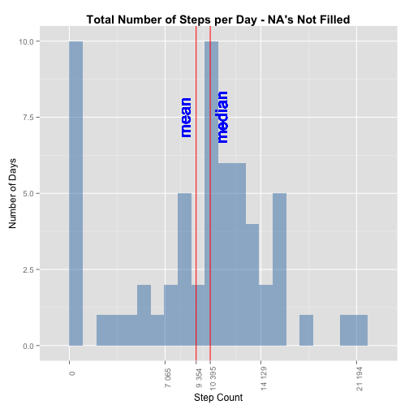
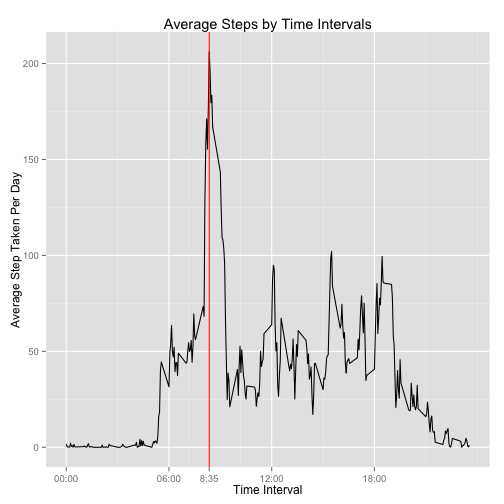
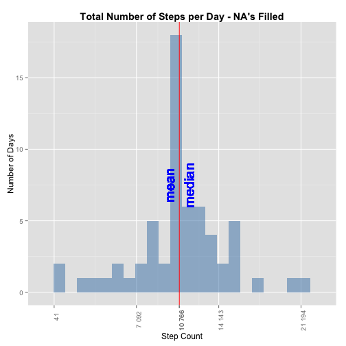

This is a markdown document for the Peer Assignment 1 of the Course "Reproducible Research". Below, you can find the answers to the questions asked in the assignment, and respective code together with the figures.  

The utilized libraries:

```r
library(dplyr);library(ggplot2);library(scales);library(stringr)
```

The data is unzipped:

```r
unzip("repdata-data-activity.zip")
```

## Loading and preprocessing the data
Load data from the activity dataset:


```r
rawdata = read.csv("activity.csv")
```

Set the type of date variable as "Date":

```r
rawdata$date = as.Date(rawdata$date)
```

The intervals are in the format "Hour & 5minInterval"; to separate hour&minute component: 

```r
HourInterval = as.vector(str_pad(rawdata$interval,4,side="left",pad= "0"))
Hour = substr(HourInterval,1,2)
Min = substr(HourInterval,3,4)
```

Create a new variable called HourMin independent of dates for plotting purposes:

```r
HourMin = paste0(Hour,":",Min)
data = cbind(rawdata,HourMin)
```

## What is mean total number of steps taken per day?
Total number of steps taken per day:

```r
TotalSteps = data %>% 
  group_by(date) %>% 
  summarize(TotalSteps = sum(steps,na.rm=T))
```

Calculate the mean and median of total steps of all days: 

```r
mean.all = mean(TotalSteps$TotalSteps);print(mean.all)
```

```
## [1] 9354
```

```r
median.all = median(TotalSteps$TotalSteps);print(median.all)
```

```
## [1] 10395
```

Histogram of the total number of steps taken each day: 
for readable number format:

```r
numformat = function (x) {format(round(x,digits=0),big.mark=" ")}
```


```r
ggplot(TotalSteps,aes(x=TotalSteps)) + 
  geom_histogram(binwidth=1000,alpha=.5,fill="steelblue") +
  xlab("Step Count") + ylab("Number of Days") + 
  ggtitle("Total Number of Steps per Day - NA's Not Filled") +
  theme(plot.title=element_text(lineheight=.8,face="bold")) + 
  geom_vline(xintercept=c(mean.all,median.all),color="red")+
  scale_x_continuous(
    breaks=sort(c(seq(min(TotalSteps$TotalSteps),max(TotalSteps$TotalSteps),length.out=4)
    ,mean.all,median.all))
    ,labels = numformat
    ) +
  theme(axis.text.x=element_text(angle=90)) +
  geom_text(aes(x=mean.all,y=7.5,label="mean"),color="blue"
            ,angle=90,size=7,vjust=-0.5)+
  geom_text(aes(x=median.all,y=7.5,label="median"),color="blue"
            ,angle=90,size=7,vjust=1.5)
```

 

Mean of the total number of steps taken per day: 

```r
MeanStep = data %>%
  group_by(date) %>%
  summarize(MeanStep = mean(steps,na.rm=T))
```

Median of the total number of steps taken per day: 

```r
MedianStep = data %>%
  group_by(date) %>%
  summarize(MedianStep = median(steps,na.rm=TRUE))
```

## What is the average daily activity pattern?

Construct the average steps by interval across all days:

```r
TimeSeries = data %>% 
  group_by(interval,HourMin) %>%
  summarize(AvgStep=mean(steps,na.rm=TRUE))
```

The interval with the highest average step: 

```r
hi.interval = as.numeric(TimeSeries$interval[which(TimeSeries$AvgStep==max(TimeSeries$AvgStep))]);print(hi.interval)
```

```
## [1] 835
```

Time series plot of the 5 minute interval vs average number of steps taken and 
the interval with highest average step: 


```r
ggplot(TimeSeries,aes(x=interval , y=AvgStep)) + 
  scale_x_continuous(breaks=c(0,600,hi.interval,1200,1800),labels=c("00:00","06:00","8:35", "12:00","18:00")) +
#  theme(axis.text.x=element_text(angle=90))+
  geom_line() + 
  xlab("Time Interval") +
  ylab("Average Step Taken Per Day") +
  ggtitle("Average Steps by Time Intervals") +
  geom_vline(xintercept=hi.interval,colour = "red")
```

 

Imputing missing values:
1: Total number of missing rows in data:  


```r
sum(is.na(data))
```

```
## [1] 2304
```

2 & 3: Fill the NAs with mean of the specific interval and create a new dataset with 
filled missing values:

```r
newdata = merge(data,TimeSeries,by="interval",all.x=T)
newdata$steps = ifelse(is.na(newdata$steps),newdata$AvgStep,newdata$steps)
newdata=newdata[,-c(5)]
```

4: histogram of total number of steps each day: 
aggregate the data on date and calculate total, mean and median steps for each day:


```r
TotalStepsNew = newdata %>% 
  group_by(date) %>% 
  summarize(TotalSteps = sum(steps)
            ,MeanSteps = mean(steps)
            ,MedianSteps = median(steps))
```

Calculate the mean and median of total steps of all days: 

```r
newmean.all = mean(TotalStepsNew$TotalSteps);print(newmean.all)
```

```
## [1] 10766
```

```r
newmedian.all = median(TotalStepsNew$TotalSteps);print(newmedian.all)
```

```
## [1] 10766
```

Next, plot histogram: 

```r
ggplot(TotalStepsNew,aes(x=TotalSteps)) + 
  geom_histogram(binwidth=1000,alpha=.5,fill="steelblue") +
  xlab("Step Count") + ylab("Number of Days") + 
  ggtitle("Total Number of Steps per Day - NA's Filled") +
  theme(plot.title=element_text(lineheight=.8,face="bold")) + 
  geom_vline(xintercept=c(newmean.all,newmedian.all),color="red")+
  scale_x_continuous(
    breaks=sort(c(seq(min(TotalStepsNew$TotalSteps),max(TotalStepsNew$TotalSteps),length.out=4)
                  ,newmean.all,newmedian.all))
    ,labels = numformat
  ) +
  theme(axis.text.x=element_text(angle=90)) +
  geom_text(aes(x=newmean.all,y=7.5,label="mean"),color="blue"
            ,angle=90,size=7,vjust=-0.5)+
  geom_text(aes(x=newmedian.all,y=7.5,label="median"),color="blue"
            ,angle=90,size=7,vjust=1.5)
```

 

## Are there differences in activity patterns between weekdays and weekends?
Creating a new variable for determining weekdays and weekend:

```r
newdata.week = newdata %>%
  mutate(weekday = weekdays(date))

newdata.week$weekday = ifelse(newdata.week$weekday %in% c("Saturday","Sunday")
       ,  "weekend"
       ,  "weekday")
```

Panel plot average steps per interval across weekdays/weekends:

```r
TimeSeriesWeek = newdata.week %>% 
  group_by(interval,HourMin.x,weekday) %>%
  summarize(AvgStep = mean(steps))

TimeSeriesWeek$weekday = as.factor(TimeSeriesWeek$weekday)

ggplot(TimeSeriesWeek,aes(x=interval , y=AvgStep)) +   scale_x_continuous(breaks=c(0,600,hi.interval,1200,1800),labels=c("00:00","06:00","8:35", "12:00","18:00")) +
  #  theme(axis.text.x=element_text(angle=90))+
  geom_line() + 
  xlab("Time Interval") +
  ylab("Average Step Taken Per Day") +
  ggtitle("Average Steps by Time Intervals") +
  facet_grid(weekday~.)
```

 
